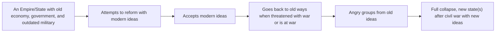

# Decline of the Ottoman Empire
==Didn't change at all==

Ottomans Attempted reforms via the Tanzimat Reforms. w/ help of Young Ottomans
- Industry and Democracy
- Worked in Short run

When threaten with war the sultan went back to authoritarian.

New group, Young Turks rose up and overthrew the sultan. Created reforms:
- New Schools detached from religon
- DEMOCRACY
- Turkic language

This pissed off other ethic groups and they rose up, breaking the Ottoman Empire
==Final nail was WW1 causing it to break apart due to not being ready for war==

# Collapse of the Russian Empire
==Failing and corrupt government==

- Ra Ra, Rasputin. Somehow making it into the royal family and messing with affairs
- ==Tsar Nicholas II== being an incompetent and ==brutal authoritarian ruler.==
- Brewing communist uprising promising peace, bread, prosperity and generally appeasing to common people
- Eventual communist overthrow after ==failed reforms and great losses from ww1==

# Fall of the Qing Dynasty in China
==Didn't change at all==

- Uses old practices
- Refused to do refroms
- Didn't use industry at all

The ==Great powers had attempted to gain power in china== to offset their trade deficit with them
- first opium war to expand trade rights
- second opium war to get people addicted
All of these wars leading to Qing Dynasty slowly loosing control and people falling to starvation and drugs
- multiple uprisings suppressed by help of imperial powers in order to keep trades
- chaos after multiple rebellions
This only leading the rise of the republic of china which later fell to the people's republic of china. Modern day China & Taiwan

# Mexican Revolution
Everyone in mexico angry at dictator Porfirio Diaz

- A revolution which attempted to from a democracy
	- First president shot
	- Another civil war
		- Pancho Villa
		- Emiliano Zapata
- Ended with new party, the PRI
	- Nationalized foreign industry
	- Universal Suffering
	- A constitution
	- Limiting the church

# Summary:
So dictators in country tried to do reforms inside their state, they eventually failed because of conflicting ideas with liberalism. Their consequences were not being able to keep up with other nations and collapsing with too much preasure, namely war.