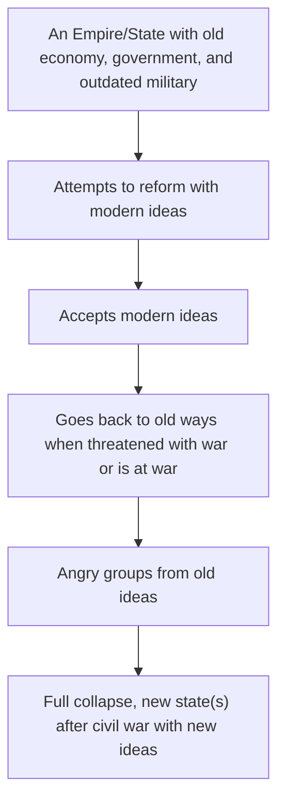

[[Unit 7.2 - Causes of WW1]]

### Decline of the Ottoman Empire

Ottomans Attempted reforms via the Tanzimat Reforms. w/ help of Young Ottomans
	- Industry and Democracy
	- Worked in Short run
When threaten with war the sultan went back to authoritarian.

New group, Young Turks rose up and overthrew the sultan. Created reforms:
	- New Schools detached from religon
	- DEMOCRACY
	- Turkic language
This pissed off other ethic groups and they rose up, breaking the Ottoman Empire

### Collapse of the Russian Empire

The Russian Empire faced internal strife due to a growing middle class and working-class grievances at the turn of the century. The 1905 Revolution was brutally suppressed, but some reforms were introduced. However, ongoing issues and the pressures of WWI culminated in the successful Bolshevik Revolution of 1917, leading to the establishment of a communist state.

### Fall of the Qing Dynasty in China

China experienced significant turmoil and external aggression which led to the decline of the Qing Dynasty. The Tai Ping and Boxer Rebellions were responses to internal oppression and foreign interference. This culminated in a revolutionary movement that resulted in the abdication of the Qing Emperor, ending over 2000 years of imperial rule, and paving the way for a provisional government that ultimately led to a communist state.

### Mexican Revolution

In Mexico, widespread dissatisfaction with the dictatorial rule of Porfirio Díaz sparked the Mexican Revolution. Francisco Madero's election led to his assassination and a decade of civil war, involving prominent leaders like Pancho Villa and Emiliano Zapata. The revolution concluded in 1917 with a new constitution enacting reforms like universal male suffrage and limiting the power of the Catholic Church, marking Mexico's emergence as a republic.
